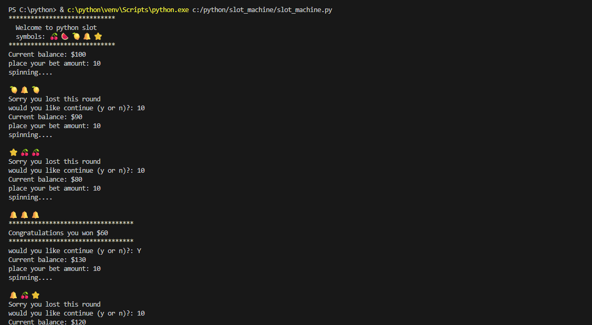
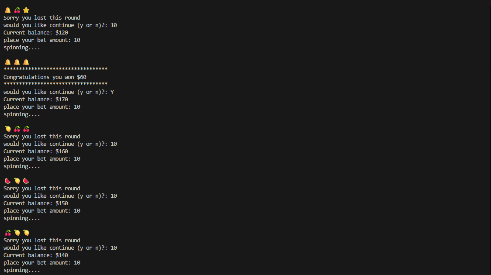
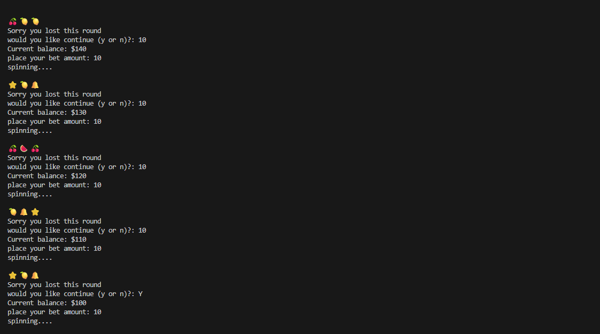
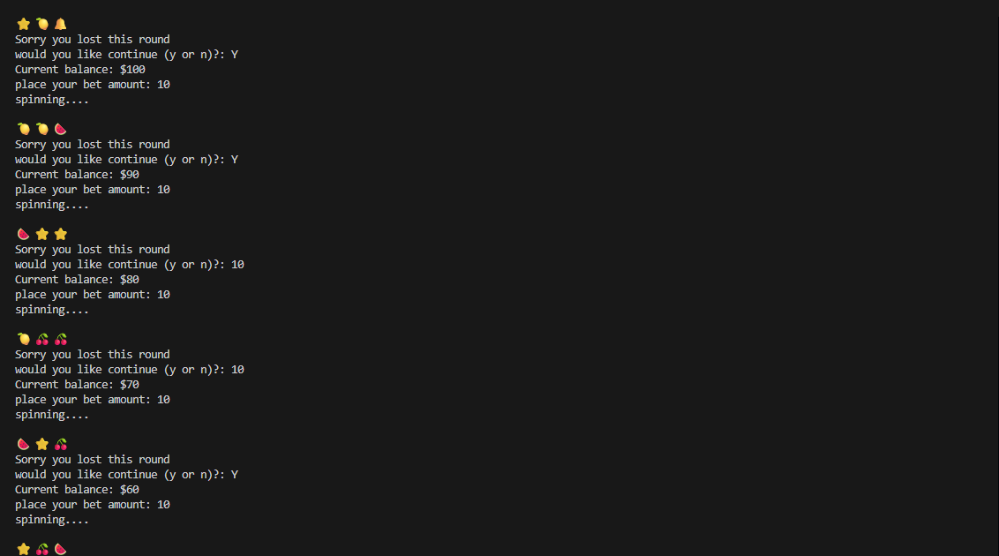
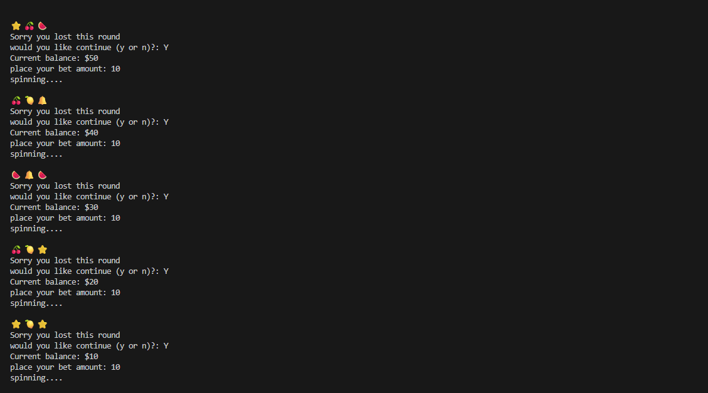
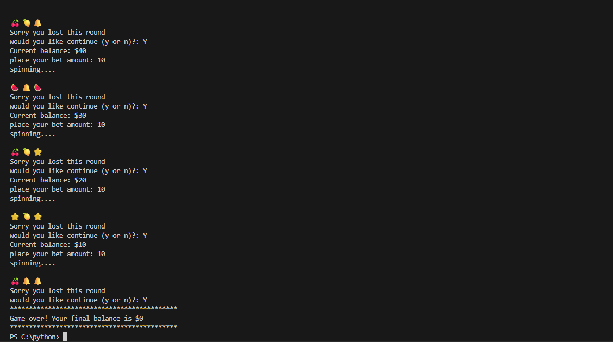

# Slot Machine

## Description

    This app spins randomly and once the user get the samething they win a certain amount of money depending on what they staked and if they dont they win nothing and keep on trying till dey run out of money.

## Steps taken to develop the project

1. Firsly import the random module

2. Next step is to define a function to randomly print out the items and keep in an empty aray called results.

3. Next step is to define a function that prints the row of the items side by side.

4. Next step is to define a function to determine how much the user earns depending on the which items align.

5. Next step is for the user to be able to spin the machine till the customer gets it until there is no more money for spinning

6. As long as bet is lesser than balance the user will keep on having chance to spin till he runs out ofmoney if the user win then will get payout.

## OUTCOME

